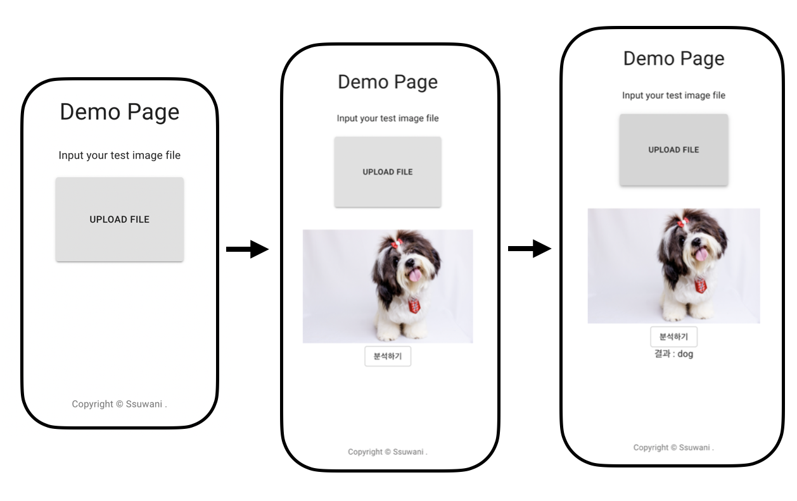

# Teachable Machine

구글에서 서비스중인 [TeachbleMachine](https://teachablemachine.withgoogle.com/) 은 손쉽게 머신러닝을 경험할 수 있도록 도와준다. 나는 실제 무거고등학교에서 고등학생을 대상으로 한 AI 교육에서 이 서비스를 사용하여 Model을 다운로드 받고 마스크 유무에 따른 자동문 프로젝트를 진행했었다.


### 왜?

 TeachableMachine에서는 최종적으로 Model을 다운로드 할 수 있다. 이는 통해 웹 어플리케이션, 모바일 어플리케이션 등에 적용할 수 있지만 머신러닝 프로젝트에 익숙치 않은 개발자의 입장에서 여러가지 문제에 직면할 수 있다.

1. 모델은 어디에 둬야 하는 걸까?
2. 모델에 입력은 어떤 것을 줘야하지?
3. 모델에 입력을 어떻게 줘야하지?
4. 모델의 출력은 어떠한 형태로 받을 수 있지?
5. 비동기 처리?


다양한 문제들에 쉽게 접근 및 해결하기 위해 데모 코드를 제공하고자 한다.


예상되는 Stack은 다음과 같다.

### Stacks

- PyTorch
- Flask
- bentoml(?)
- React
- Flutter


# 개발로그!

**2021.06.02**

---

**오늘은 demo 페이지를 만들어 보았습니다!**



사용자의 학습이 종료되고 나면 pt 파일과 class_index.json 파일을 생성해서 demo 폴더 내에 위치시킵니다.


**데모 프로젝트 다운로드**

React에서 다운로드 버튼을 누르면 Flask에서 demo folder를 zip형태로 압축한 뒤 flask의 `send_from_directory` 메서드를 route로 연결하면 react에서 다운로드 받을 수 있습니다.


이후에도 demo를 실행하기 위해 해야할 일이 많이 있습니다.

- `npm install` 관련 패키지 설치하기
- 파이썬 가상환경 생성 및 패키지 설치
- flask 서버 실행 `flask run`  , react 스크립트 실행 `react start` 


복잡한 과정들이다보니 빠르게 실행할 수 있게 bash 파일을 하나 만들자!


**2021.06.01**

---

최근에 만든 [make-train-dataset](https://github.com/Ssuwani/make-train-dataset) repo를 기반으로 dataset 구축 파일을 다시 작성하였다.


**2021.05.17**

---

### 키워드를 받아 학습한 뒤 결과 이미지를 React에서 보여주기

---

위 키워드의 진행과정은 다음과 같다.

1. React에서 클래스명 입력
2. Training 버튼 클릭 시 클래스명이 Flask로 전송
3. Flask에서 클래스명에 해당되는 이미지 다운로드
4. 학습
5. 학습결과 이미지를 Flask 서버에서 업로드
6. React에서 이미지 확인


이 중 5번, 6번의 내용을 작성해두려 한다.


학습이 완료한 뒤 생성한 아래와 같은 이미지를 react에서 볼 수 있게 하고자 하였다.

  


아래의 코드는 flask에서 제공하는 send_file이라는 메서드를 통해 get으로 해당 URL에 접근시 이미지 파일을 볼 수 있게 해준다.

```python
@app.route('/result/<user_id>', methods=['GET'])
def give(*user_id*):
    file_path = f'./train_result_images/{user_id}.png'
    return send_file(file_path)
```


따라서 손쉽게 결과 이미지를 React에서 표현할 수 있었다.

```react

```


여전히 허접하지만 결과 페이지는 다음과 같다.

 


**2021.05.14**

---

### 이미지를 위한 GridList를 제거한 뒤 React 페이지

---

기본적으로 Input Classes에 Dog랑 Cat을 넣어두었고 수정버튼 또한 잘 동작한다. [react-edittext](https://alioguzhan.github.io/react-editext/)를 이용해서 텍스트 수정을 구현하였다. react-edittext를 발견하기 전에 만들어 놓은 부분이 있다는 거 혹시 모르니 까먹지 말자.! 


아래의 간단한 페이지를 구현하면서 내가 어려움을 겪었던 부분은 Layout 부분이다. CSS를 제대로 배우지 않아 이 부분이 항상 조금 어렵다. Material ui의 Grid를 이용해서 레이아웃을 설정하였고 내부에 Paper로 화면을 구분지었다.


  


### 고민중인 내용

---

굳이 train 할 이미지를 사용자에게 보여줘야 할까? 

보여주기 위한 task

1. flask에서 Image URL 생성 
2. React Gallery 구현
3. 이미지 삭제 기능 (React에서 요청 -> Flask에 반영)


정말 간단하게 구현한 다음에 정말 필요하다 생각이 드는 내용들을 추가하는 게 맞는 거 같다는 생각을 한다.!! 빼고 해보자! 


### 훈련을 위한 데이터 다운로드

---

아래의 google-images-download 덕분에 편하게 다운로드를 받을 수 있는 것 같다.  없었더라면 beautiful soup 다시 찾아보고.. url 긁어와서 다운로드 받는 귀찮음이 있었을텐데 다행이다.


그래도 나한테 문제가 되는 부분은 있었다.


└── dog
    ├── 1.d41586-020-01430-5_17977552.jpg
    ├── 10.gettyimages-559514141-1.jpg
    ├── 2.3408.jpg
    ├── 3.1800x1200_dog_cool_summer_other.jpg.webp
    ├── 4.maxresdefault.jpg
    ├── 5.the_science-backed_benefits_of_being_a_dog_owner.jpg
    ├── 6.puppy-410265.jpg
    ├── 7.domestic-dog_thumb.jpg.webp
    ├── 8.dogs_1280p_0.jpg
    └── 9.yellow-labrador-retriever.jpg


keyword를 dog로 format을 jpg로 10개의 이미지를 다운로드 받았는데 .jpg.webp 라는 파일도 섞여 있었다. google-images-download에서 미처처리하지 못한 부분이라 생각이 들었다. 그래서 webp to jpg라는 키워드로 검색해보니 생각보다 간단하게 파일 변환이 가능했다.

```python
from PIL import Image

image = Image.open("file.webp").convert("RGB")
image.save('file.jpg')
```


게다가 이름도 복잡하다고 생각이 들어서 그냥 순서대로 이름을 변경해주었다.


└── dog
    ├── 0.jpg
    ├── 1.jpg
    ├── 2.jpg
    ├── 3.jpg
    ├── 4.jpg
    ├── 5.jpg
    ├── 6.jpg
    ├── 7.jpg
    ├── 8.jpg
    └── 9.jpg


### [google-images-download](https://pypi.org/project/google_images_download/) issue

---

공식적으로 pip를 통해 패키지를 다운받을 수 있는데 이미지가 ```Unfortunately all 2 could not be downloaded because some images were not downloadable. 0 is all we got for this search filter!`` 다음과 같은 에러가 나온다.. 

```bash
# pip install google_images_download 
```

다른분이 기존 google-images-download를 Fork 한 페이지에서 다운로드 받으면 문제가 해결되었다.

```bash
pip install git+https://github.com/Joeclinton1/google-images-download
```


### React 페이지 초안..

---

정말 없어보이지만.. 시작이니까!!   

전체적인 레이아웃을 고민해봤는데 Teachable Machine 과 같이 한 페이지에 모든 내용을 볼 수 있다면 그렇게 하는게 낫다고 판단하였다.

대부분의 디자인을 [Material UI](https://material-ui.com/)의 Component를 이용할 생각이다. 아래의 이미지 리스트 또한 material ui의 GridList를 이용하여 손쉽게 구현할 수 있었다. 

**현재 이미지가 보이지 않는이유**

React에서 Static 이미지로 개, 고양이를 보여주려 했으나 어짜피 사용자가 Class명을 변경하면 React에서 이미지를 다운로드 받을 것이 아니기 때문에 의미가 없다고 생각해서 Flask내에서 이미지 url을 생성해서 그걸 보여주는게 낫다고 판단했다. 그래서 지금부터 Flask로 이동


 

 