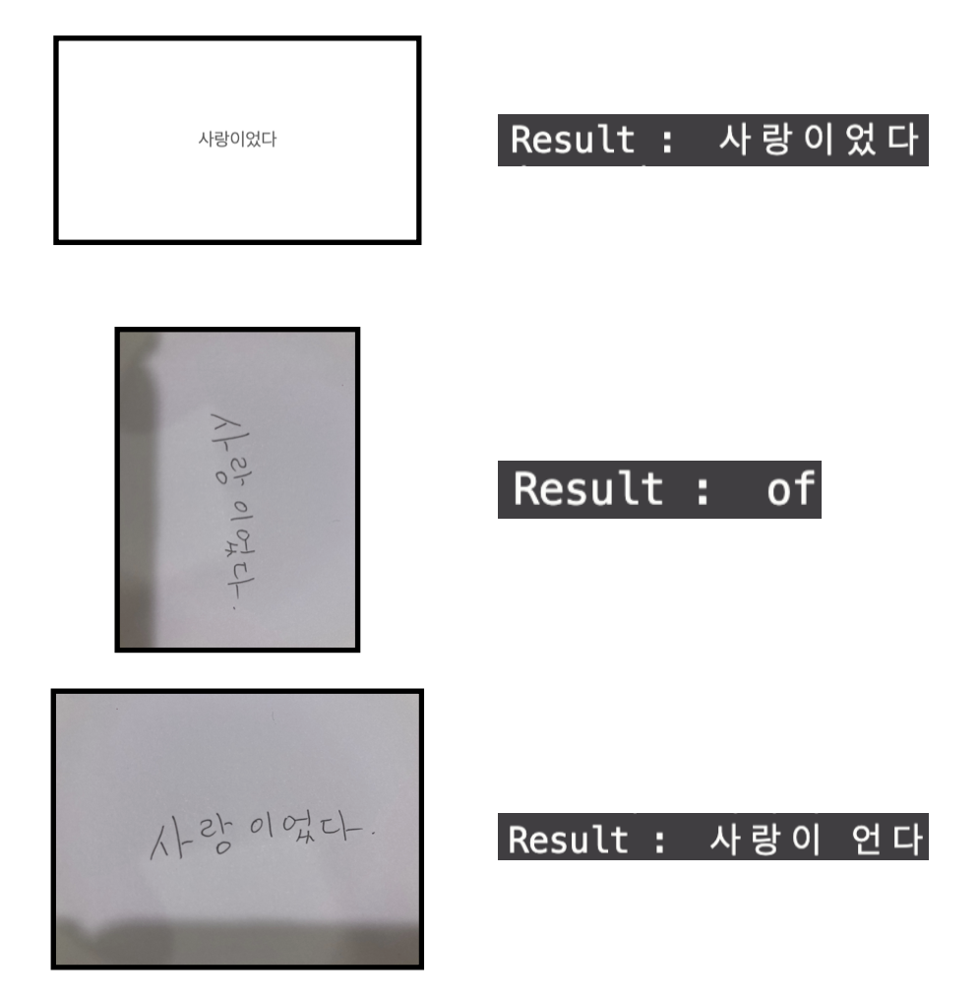
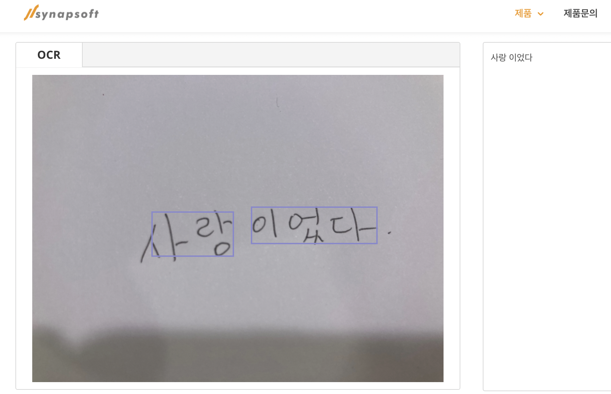

# Vinyl

촌뜨기가 이태원에 바(?)에 놀러갔던 적이 있다. 거기서 신청곡을 포스트잇에 적어내면 노래를 틀어줬었다. 포스트잇에 적는 그 과정에서 뭔가 따뜻함과 진지함을 느낄 수 있었던 것 같다. 

이 프로젝트는 아날로그 신청곡 플레이어이다. Vinyl이 적절한 작명인지 모르겠지만 레코드판을 검색해보니 영어로 Vinyl라고 한다..

위의 경험대로 특정 위치에 신청곡이 적힌 포스트잇을 두면 해당되는 노래가 나오는 서비스를 만들어보고자 한다.

### Stacks

- OCR (kakao api)
- Flask
- Raspberry PI

# 개발로그!

**2021.05.19**

---

프로젝트의 핵심이라고 할 수 있는 OCR에 대한 내용을 먼저 다뤄보고자 한다.

가장 쉽게 사용할 수 있고 어느정도 신뢰할 수 있는 [Kakao OCR](https://vision-api.kakao.com/#ocr) 을 사용해보려 한다.

가이드에 어떻게 사용하면 되는지 충분히 잘 나와있기에 사용에는 문제가 없었다.

하지만 정확도에 문제가 있었다. 컴퓨터를 통해 작성한 image 파일은 아주 잘 문자를 추출했지만 손글씨를 핸드폰으로 찍으니 제대로 인식하지 못했다. 또한  세로방향의 글자 이미지를 입력으로 주니 엉뚱한 문자가 출력되었다.

 

여기서 내가 지금 생각나는 선택지는 다음과 같다.

1. 입력 이미지 전처리
2. 결과를 Google의 "수정된 검색어에 대한 결과"에 넣어 크롤링 (오타를 잡아주는 하나의 방법..?)
3. 모델 변경 ([사이냅소프트](https://www.synapsoft.co.kr/ocr)에서 제공하는 OCR 체험하기에 입력하니 제대로 된 결과를 받을 수 있었다.)

