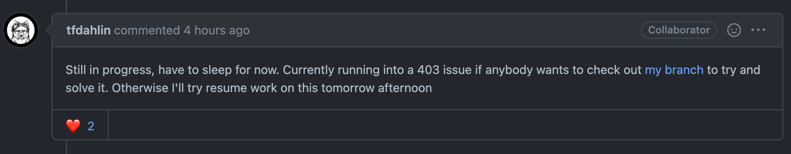
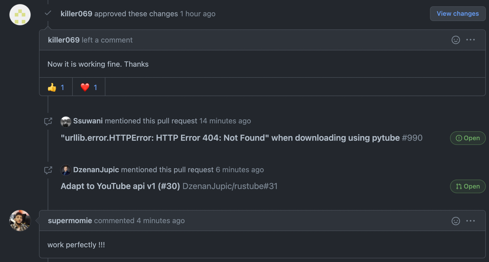

# Vinyl

촌뜨기가 이태원에 바(?)에 놀러갔던 적이 있다. 거기서 신청곡을 포스트잇에 적어내면 노래를 틀어줬었다. 포스트잇에 적는 그 과정에서 뭔가 따뜻함과 진지함을 느낄 수 있었던 것 같다. 

이 프로젝트는 아날로그 신청곡 플레이어이다. Vinyl이 적절한 작명인지 모르겠지만 레코드판을 검색해보니 영어로 Vinyl라고 한다..


위의 경험대로 특정 위치에 신청곡이 적힌 포스트잇을 두면 해당되는 노래가 나오는 서비스를 만들어보고자 한다.


### Stacks

- OCR (kakao api)
- Flask
- Raspberry PI


# 개발로그!

**2021.05.20**

---

### [pytube](https://github.com/pytube/pytube) 첫번째 오픈소스 기여!!

---

youtube 에서 mp3 파일을 다운받기 위해 pytube라는 라이브러리를 사용하는 데 `HTTP 404 Error` 에러가 나서 제대로 동작이 안됐다.. 찾아보니 이슈화 되지 않았지만 가장 기본 예제도 실행되지 않아 많은 사용자들에게 되고 있는 것을 알게되었다. [Issue](https://github.com/pytube/pytube/issues/990) 

한 개발자가 문제에 대해 밤을 새 해결할 거라고 이야기를 하더니 이내 자러가야 한다고 누가 해결해달라고 올려놓은 것을 보았다. 




그래서 혼자서 열심히 코드를 디버깅 해가며 문제가 되는 부분을 발견하고 해결하였다. 

youtube에서 기본적으로 `get_video_info` 메서드를 통해 video info를 제공해주고 있었는데 기존 pytube에서 사용하던 params 전체를 입력으로 주어서 정보를 받아오는 코드가 youtube 서버상에서 문제가 되었다고 생각한다. 그래서 id 값을 통해 정보를 받아오는 방식으로 변경해주었다.


올린지 12분 되었는데 메일로 "똑똑하다", "잘 동작한다" 등을 코멘트를 실시간으로 달아주기도 하고 또 다른 [레포지토리 이슈](https://github.com/DzenanJupic/rustube/pull/31)에서 내 PR을 언급하며 "해결했다"고 하는 모습들을 보며 정말 신선하고 기분이 좋다... 




### OCR 서비스 확정 [NCP OCR]

---

후 돌고 돌아 naverocr을 사용하기로 마음먹었다.

NaverOCR에 대한 사용을 잘 설명해준 [블로그](https://dev-sngwn.github.io/2019-12-17-korean-ocr-step-by-step-1/)가 있어서 쉽게 테스트 할 수 있었다.

아래는 어제 "사랑이었다"를 입력한 내 손글씨 데이터에 NaverOCR을 통한 Output 값이다. 


아참 그리고 naverOCR은 유료다.. 월 100회가 무료이고 건당 3원이다. 가격은 일단 생각하지 않고 편하게 테스트 진행하려 한다.. 무한루프 도는 일만 없게하자..! !

```json
{
   "version":"V1",
   "requestId":"sample_id",
   "timestamp":1621483160639,
   "images":[
      {
         "uid":"e0fad1c7610e4961b84c09600998c127",
         "name":"sample_image",
         "inferResult":"SUCCESS",
         "message":"SUCCESS",
         "validationResult":{
            "result":"NO_REQUESTED"
         },
         "fields":[
            {
               "valueType":"ALL",
               "boundingPoly":{
                  "vertices":[
                     {
                        "x":330.0,
                        "y":468.0
                     },
                     {
                        "x":741.0,
                        "y":433.0
                     },
                     {
                        "x":761.0,
                        "y":666.0
                     },
                     {
                        "x":350.0,
                        "y":702.0
                     }
                  ]
               },
               "inferText":"사랑",
               "inferConfidence":1.0
            },
            {
               "valueType":"ALL",
               "boundingPoly":{
                  "vertices":[
                     {
                        "x":746.0,
                        "y":445.0
                     },
                     {
                        "x":1239.0,
                        "y":445.0
                     },
                     {
                        "x":1239.0,
                        "y":607.0
                     },
                     {
                        "x":746.0,
                        "y":607.0
                     }
                  ]
               },
               "inferText":"이었다",
               "inferConfidence":0.9998
            }
         ]
      }
   ]
}
```


**2021.05.19**

---

프로젝트의 핵심이라고 할 수 있는 OCR에 대한 내용을 먼저 다뤄보고자 한다.


가장 쉽게 사용할 수 있고 어느정도 신뢰할 수 있는 [Kakao OCR](https://vision-api.kakao.com/#ocr) 을 사용해보려 한다.

가이드에 어떻게 사용하면 되는지 충분히 잘 나와있기에 사용에는 문제가 없었다.

하지만 정확도에 문제가 있었다. 컴퓨터를 통해 작성한 image 파일은 아주 잘 문자를 추출했지만 손글씨를 핸드폰으로 찍으니 제대로 인식하지 못했다. 또한  세로방향의 글자 이미지를 입력으로 주니 엉뚱한 문자가 출력되었다.

 


여기서 내가 지금 생각나는 선택지는 다음과 같다.

1. 입력 이미지 전처리
2. 결과를 Google의 "수정된 검색어에 대한 결과"에 넣어 크롤링 (오타를 잡아주는 하나의 방법..?)
3. 모델 변경 ([사이냅소프트](https://www.synapsoft.co.kr/ocr)에서 제공하는 OCR 체험하기에 입력하니 제대로 된 결과를 받을 수 있었다.)

